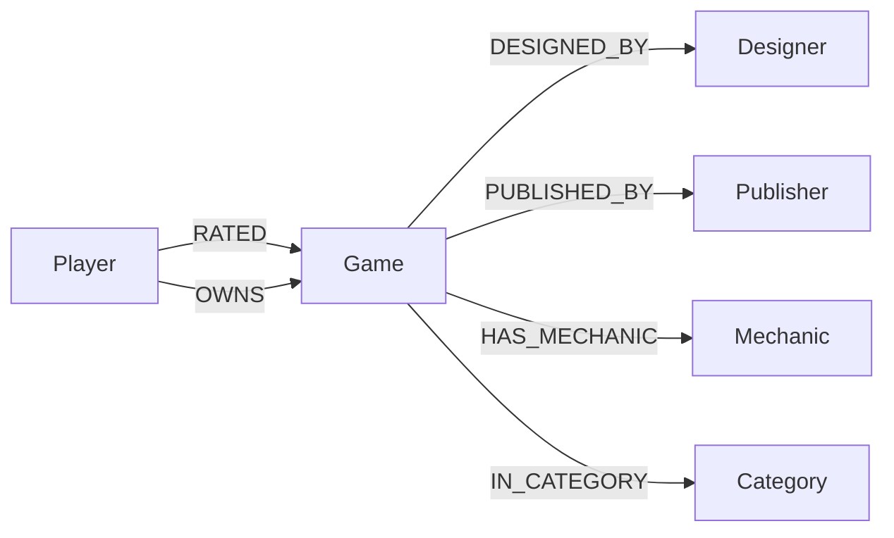

# BoardGraph 📌🧵

**BoardGraph** is a board-game discovery engine — a "corkboard" you can pull red string across to see how games, designers, mechanics and players connect. It's backed entirely by **CognoDB**, a managed graph database, over the Bolt protocol using the official Neo4j JavaScript driver.

Live demo: **`<https://boardgraph.onrender.com/>`**
Screen recording: **`<https://drive.google.com/file/d/13dc91s0hoKCp9NRgsH59N7tn0cQiFVyX/view?usp=drive_link>`**

---

## Contents

- [Why a graph database?](#why-a-graph-database)
- [Data model](#data-model)
- [The queries, explained](#the-queries-explained)
- [Project structure](#project-structure)
- [Setup](#setup)
  - [1. Create a CognoDB Cloud instance](#1-create-a-cognodb-cloud-instance)
  - [2. Configure the app](#2-configure-the-app)
  - [3. Install, seed, run](#3-install-seed-run)
- [Deploying](#deploying)
- [Screenshots](#screenshots)

---

## Why a graph database?

BoardGraph's whole premise is **"what connects to what, and how far away is it?"** — exactly the class of question relational databases handle poorly and graph databases handle natively:

- **Similarity is a traversal, not a join explosion.** "Games like this one" means walking `Game → Mechanic → Game` and `Game → Category → Game` and combining the results. In SQL that's a self-join of a `game_mechanics` bridge table against itself, another self-join for categories, a `GROUP BY`, and a `HAVING` — and it gets worse every time you add another shared-attribute type. In Cypher it's one pattern match.
- **Recommendations are multi-hop and weighted.** The recommendation engine walks `Player → RATED → Game → HAS_MECHANIC → Game`, a 3-hop traversal, weighting candidates by the player's own rating and by how many mechanics overlap. Expressing that in SQL means chaining three joins and hand-rolling a scoring `CASE`/`SUM` — brittle, and it only gets worse if you add a fourth hop (e.g. "games their friends own").
- **Path-finding is genuinely hard in SQL.** The Path Finder answers "what's the shortest chain of shared games connecting Designer A and Designer B?" — an *unbounded*, variable-length traversal. SQL has no native shortest-path operator; you'd need a recursive CTE with manual cycle detection and depth limits, and it still wouldn't guarantee the *shortest* path without extra bookkeeping. In Cypher this is `shortestPath((a)-[:DESIGNED_BY*..10]-(b))` — one line, index-backed, and guaranteed shortest.
- **The schema is naturally sparse and irregular.** Some games have one designer, some have three; some belong to two categories, some to four. Modeling that in SQL means bridge tables for every many-to-many relationship (`game_designers`, `game_mechanics`, `game_categories`, `player_ratings`, `player_ownership`...). In the graph, each of those *is* a relationship type — there's no schema ceremony for "sometimes zero, sometimes many."

None of this needs a huge dataset to matter — the awkwardness of the relational version shows up in the query itself, not in how much data it scans, which is why a free-tier CognoDB instance (a few hundred nodes, a few thousand relationships) is enough to make the case.

## Data model



| Node | Key property | Notes |
|---|---|---|
| `Game` | `title` (unique) | `year`, `minPlayers`, `maxPlayers`, `playTime`, `complexity`, `description` |
| `Designer` | `name` (unique) | |
| `Publisher` | `name` (unique) | |
| `Mechanic` | `name` (unique) | e.g. *Worker Placement*, *Drafting*, *Deck Building* |
| `Category` | `name` (unique) | e.g. *Strategy*, *Cooperative*, *Party* |
| `Player` | `name` (unique) | demo persona; `bio` |

| Relationship | Direction | Properties |
|---|---|---|
| `(:Game)-[:DESIGNED_BY]->(:Designer)` | Game → Designer | — |
| `(:Game)-[:PUBLISHED_BY]->(:Publisher)` | Game → Publisher | — |
| `(:Game)-[:HAS_MECHANIC]->(:Mechanic)` | Game → Mechanic | — |
| `(:Game)-[:IN_CATEGORY]->(:Category)` | Game → Category | — |
| `(:Player)-[:RATED]->(:Game)` | Player → Game | `score` (1–5) |
| `(:Player)-[:OWNS]->(:Game)` | Player → Game | — |

Seed data: 37 real board games (real titles, designers, publishers, mechanics, years) and 6 demo player personas with ratings and ownership, loaded by [`server/seed/seed.js`](server/seed/seed.js) from [`server/seed/data.js`](server/seed/data.js).

## The queries, explained

All Cypher lives in one place: [`server/queries.js`](server/queries.js). The interesting ones:

**`SIMILAR_GAMES`** — used on the game detail page. A 2-hop traversal from a game through its mechanics and categories back out to other games, aggregating how many are shared:

```cypher
MATCH (g:Game {title: $title})-[:HAS_MECHANIC]->(m:Mechanic)<-[:HAS_MECHANIC]-(other:Game)
WHERE other <> g
WITH other, collect(DISTINCT m.name) AS sharedMechanics
...
RETURN other.title, sharedMechanics, sharedCategories,
       size(sharedMechanics) + size(sharedCategories) AS score
ORDER BY score DESC LIMIT 8
```

**`RECOMMENDATIONS_FOR_PLAYER`** — the multi-hop, weighted query behind the Recommendations tab. It walks `Player → (highly-rated) Game → Mechanic → candidate Game`, excludes anything the player already owns, and weights results by the sum of the ratings that led to each candidate:

```cypher
MATCH (p:Player {name: $name})-[r:RATED]->(liked:Game) WHERE r.score >= 4
MATCH (liked)-[:HAS_MECHANIC]->(m:Mechanic)<-[:HAS_MECHANIC]-(rec:Game)
WHERE NOT (p)-[:OWNS]->(rec) AND rec <> liked
WITH rec, p, sum(r.score) AS weightedScore, collect(DISTINCT m.name) AS viaMechanics
RETURN rec.title, weightedScore, viaMechanics
ORDER BY weightedScore DESC LIMIT 8
```

**`DESIGNER_PATH`** — the Path Finder tab's headline query: an unbounded, variable-length shortest path between two designers through shared games:

```cypher
MATCH (a:Designer {name: $from}), (b:Designer {name: $to})
MATCH path = shortestPath((a)-[:DESIGNED_BY*..10]-(b))
RETURN [n IN nodes(path) | {label: head(labels(n)), name: coalesce(n.name, n.title)}] AS nodes,
       length(path) AS hops
```

**`DESIGNER_NETWORK`** — "designers who worked with people who worked with X," a 2-hop co-designer traversal, used for the extended-network idea (surfaced via the `/api/designers/:name/network` endpoint).

**`LIST_GAMES`** — the one deliberately "boring" query: a filtered single-label scan, included as the baseline the graph queries are contrasted against.

Every statement above is parameterised (`$title`, `$name`, `$from`, `$to`, ...) and executed through the official driver — there is no string-concatenated Cypher anywhere in the codebase.

## Project structure

```
boardgraph/
├── server/
│   ├── index.js          # Express app, routes, health check, graceful shutdown
│   ├── db.js              # CognoDB/neo4j-driver connection singleton
│   ├── queries.js         # All Cypher, documented, one export per query
│   ├── routes/
│   │   ├── games.js        # /api/games, /api/games/:title, /api/games/:title/similar
│   │   ├── players.js      # /api/players, ratings, recommendations
│   │   └── designers.js    # /api/designers, network, shortest-path finder
│   └── seed/
│       ├── data.js         # Seed dataset (games, designers, mechanics, players...)
│       └── seed.js         # Idempotent loader (constraints + parameterised MERGE)
├── public/                # Static frontend — vanilla HTML/CSS/JS, no build step
│   ├── index.html
│   ├── css/style.css
│   └── js/app.js
├── .env.example
├── package.json
└── README.md
```

## Setup

### 1. Create a CognoDB Cloud instance

1. Go to **https://console.cognodb.com/signup** and create a free account (no credit card required).
2. In the console, create a **free (c0) instance** and pick a region. It provisions in under a minute — each workspace gets one free instance.
3. Copy the connection URI (`bolt+s://<instance-id>.databases.cognodb.cloud`) and the generated password for the `cognodb` user. **The password is shown once** — save it immediately.

### 2. Configure the app

```bash
cp .env.example .env
```

Edit `.env`:

```ini
COGNODB_URI=bolt+s://<your-instance-id>.databases.cognodb.cloud
COGNODB_USER=cognodb
COGNODB_PASSWORD=<your-generated-password>
PORT=3000
```

`.env` is git-ignored — credentials never get committed.

### 3. Install, seed, run

```bash
npm install
npm run seed     # loads constraints + the seed dataset into CognoDB
npm start         # serves the app at http://localhost:3000
```

`npm run seed` is idempotent (every write is a parameterised `MERGE` keyed on a unique property), so re-running it won't create duplicates. If CognoDB is unreachable — wrong credentials, instance still provisioning, network hiccup — the app doesn't crash: the server boots regardless, `/api/health` reports `503`, and the frontend shows a "database unreachable, retrying…" banner instead of a blank page or a stack trace.

## Deploying

BoardGraph is a single Node/Express process that serves both the API and the static frontend, so it deploys anywhere that runs a Node app:

1. Push this repo to GitHub.
2. Create a new web service on a free host (Render, Railway, Fly.io, and similar all have a free tier).
3. Point it at this repo, set the start command to `npm start`, and add the same three environment variables from `.env` (`COGNODB_URI`, `COGNODB_USER`, `COGNODB_PASSWORD`) in the host's dashboard.
4. Run `npm run seed` once against the same CognoDB instance (locally, pointed at production credentials, or as a one-off job on the host) to populate the data.
5. Keep the CognoDB instance running so the demo stays live.

Drop the resulting URL at the top of this README and record a short screen walkthrough (Browse → a game's detail/similar view → Recommendations for a player → Path Finder between two designers) before submitting.

## Screenshots

_Add screenshots here after running the app locally — e.g. the Browse corkboard, a game detail panel, the Recommendations view, and the Path Finder's string-and-pins result._

| Browse | Game detail | Recommendations | Path Finder |
|---|---|---|---|
| _screenshot_ | _screenshot_ | _screenshot_ | _screenshot_ |
